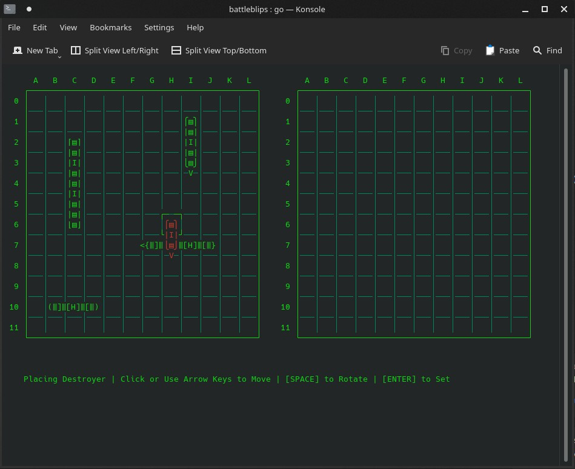
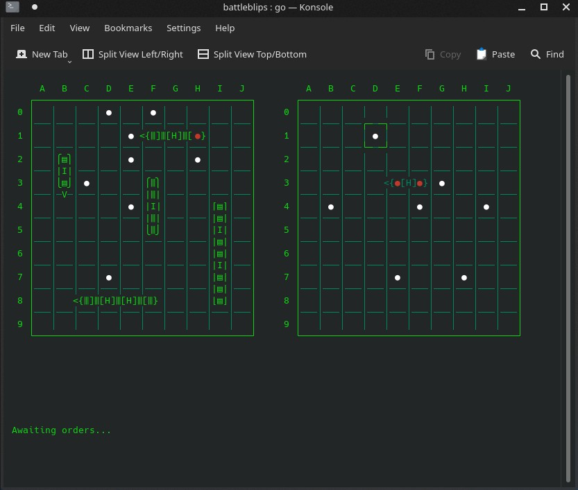

# battleblips
Work in progress multiplayer terminal base battleship game written in Go (with mouse support!) using tcell library (see https://github.com/gdamore/tcell).

```
go run main.go

or
```
```
go build main.go
./main
```
Adjustable board sizing and ship numbers from setup parameters!


Mouse support for click events in terminal


Todo: Menu and options, multiplayer over local network, custom colors, and better computer player.